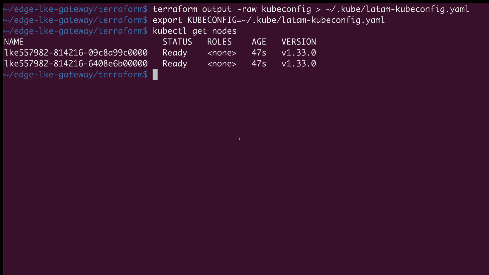

# Edge LKE Gateway Demo

This project simulates Akamai EdgeWorker behavior using [Envoy Gateway](https://gateway.envoyproxy.io) on a Linode Kubernetes Engine (LKE) cluster. It demonstrates how to deploy a regional API backend with latency-aware routing and simulate "at-the-edge" behavior using the Gateway API and Envoy filters.


---

## ✅ Overview

- ✅ API backend served from LKE
- ✅ Envoy Gateway installed via Helm with `LoadBalancer` service
- ✅ Gateway API v1 resources (GatewayClass, Gateway, HTTPRoute)
- ✅ Simulated "EdgeWorker" logic via request header injection
- ✅ Real-world latency testing from LATAM regions

---

## 🌐 Architecture

```
                           Akamai DNS / curlip.com probe
+--------------------+    Host: api.myapp.lat    +-----------------------+
| curlip.com          | -----------------------> | Envoy Gateway LB       |
| (LATAM PoPs)        |                          | (LKE Cluster)          |
+--------------------+                          |  +------------------+  |
                                                |  | edge-api Service  |  |
+--------------------+    Host: api.myapp.lat   |  |  /api/healthz     |  |
| API Client         | -----------------------> |  +------------------+  |
+--------------------+                          +-----------------------+
```


## Structure

- `terraform/`: Terraform code to provision LKE cluster
- `kubernetes/`: Deployment, service, and envoy gateway with `HTTPRoute`


## 🚀 Deployment Steps

This guide walks you through deploying an API gateway using **Envoy** in front of a **Linode Kubernetes Engine (LKE)** backend API. Ideal for low-latency, low-cost API delivery across LATAM.

### 📦 Requirements

* [ ] Linode account with API token
* Kubernetes 1.27+
* Helm 3.11+
* LKE or any Kubernetes cluster with public LoadBalancer support
* `curl` and access to `curlip.com` for regional tests


---

### 🛠️ Step 1: Provision LKE Cluster

1. Create a Linode API token: Linode Console → Profile → API Tokens → Create a Personal Access Token with `Linodes` (read/write) and `Kubernetes` (read/write).


2. Set your Linode token as a variable:

```bash
export TF_VAR_linode_token=your-token-here
```

3. Deploy the cluster:

```bash
cd terraform
terraform init
terraform apply
```

4. Save the kubeconfig and test access:

```bash
terraform output -raw kubeconfig > ~/.kube/latam-kubeconfig.yaml

export KUBECONFIG=~/.kube/latam-kubeconfig.yaml

kubectl get nodes
```


---

### ⚙️ STEP 2: Install Envoy Gateway with LoadBalancer

```bash
# https://gateway.envoyproxy.io/latest/install/install-helm/

helm install eg oci://docker.io/envoyproxy/gateway-helm \
  --version v0.0.0-latest \
  -n envoy-gateway-system --create-namespace
```



> This command will create several resources in the `envoy-gateway-system` namespace, including the gateway API CRDs, the envoy gateway deployment that deploys the envoy proxy instance, and the ClusterIP service.


### ⚙️ STEP 3: Deploy Gateway API Resources

```bash
kubectl apply -f ../kubernetes/envoy-gw-and-httproute.yaml

```

This includes:

* `GatewayClass`
* `Gateway` bound to `api.myapp.lat`
* `HTTPRoute` with header filter simulating EdgeWorker logic


> This will create a Service of type LoadBalancer, and Linode will automatically provision a NodeBalancer.

### ⚙️ STEP 4: Deploy Your API Backend

1. Create a simple API (Simpe Go App) and expose it as a Kubernetes service.

2. Apply the sample manifests:

```bash
kubectl apply -f ../kubernetes/deployment.yaml


```

3. Verify public access:

```bash
k -n envoy-gateway-system get svc

curl -H "Host: api.myapp.lat" http://172.233.4.110/api/healthz 


```


### STEP 5: LATAM Latency Testing

1. Sample Output

```bash
$ curl -H "Host: api.myapp.lat" http://<EXTERNAL-IP>/api/healthz
ok%

$ curl -w "\nConnect: %{time_connect}s\nTotal: %{time_total}s\n" \
  -H "Host: api.myapp.lat" http://<EXTERNAL-IP>/api/healthz
ok
Connect: 0.165102s
Total: 0.557387s
```
This is the actual response body from your backend service — your /api/healthz endpoint is working.

⏱ Connect: 0.165102s
Time taken to establish the TCP connection to 172.233.4.110:
- Includes DNS resolution and the TCP handshake
- Fast connection suggests the NodeBalancer is reachable and healthy

⏱ Total: 0.557387s
Time from start to finish of the HTTP request:
- Includes TCP connection, sending the request, waiting for the response, and receiving it
- Useful to spot backend slowness or excessive network latency


2. To validate edge performance from Latin American regions, run the following:

```bash
bash test-latency-latam.sh
```

Probes run from:

* 🇧🇷 São Paulo
* 🇨🇱 Santiago
* 🇲🇽 Mexico City
* 🇨🇴 Bogotá
* 🇵🇪 Lima
* 🇺🇾 Montevideo

The script uses [curlip.com](https://curlip.com) to simulate regional edge probing and returns:

* `Connect Time`
* `Time to First Byte (TTFB)`
* `Total Response Time`


3. Example output:

```
🌎 Testing from: Brazil_Sao_Paulo

Connect: 0.677734s
Total: 1.041497s
---------------------------------------------
🌎 Testing from: Chile_Santiago

Connect: 0.167858s
Total: 0.541343s
---------------------------------------------
🌎 Testing from: Colombia_Bogota

Connect: 0.171347s
Total: 0.532765s
---------------------------------------------
🌎 Testing from: Mexico_MexicoCity

Connect: 0.167988s
Total: 0.524381s
---------------------------------------------
🌎 Testing from: Argentina_BuenosAires

Connect: 0.169061s
Total: 0.518402s
---------------------------------------------
🌎 Testing from: USA_Dallas

Connect: 0.168390s
Total: 0.518883s
---------------------------------------------
```

We validated edge accessibility using `curlip.com` to simulate user traffic from key LATAM cities and compare it against a US baseline.

| Location             | Connect Time | Total Time |
|----------------------|--------------|------------|
| 🇧🇷 São Paulo         | 0.68s        | 1.04s      |
| 🇨🇱 Santiago          | 0.17s        | 0.54s      |
| 🇨🇴 Bogotá            | 0.17s        | 0.53s      |
| 🇲🇽 Mexico City       | 0.17s        | 0.52s      |
| 🇦🇷 Buenos Aires      | 0.17s        | 0.52s      |
| 🇺🇸 Dallas (Baseline) | 0.17s        | 0.52s      |

> ✅ This confirms the Envoy Gateway deployed on LKE provides low-latency responses across LATAM.

---

## 📘 References

* [Envoy Gateway Documentation](https://gateway.envoyproxy.io)
* [Gateway API Spec](https://gateway-api.sigs.k8s.io/)
* [curlip.com](https://curlip.com)


---

## 📌 Notes for LATAM Deployments

* Use LKE in **São Paulo (`br-gru`)** for lowest latency
* Akamai Edge PoPs exist in **Bogotá, Santiago, Lima, Buenos Aires, and Mexico City**
* This ensures end users hit edge logic in-country before ever reaching the cloud

---

## 📚 Next Steps

* Add API token revocation with EdgeKV
* Add caching with `cacheKey` logic in EdgeWorker
* Add OpenTelemetry in LKE backend for tracing
